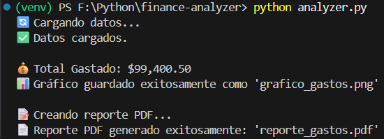
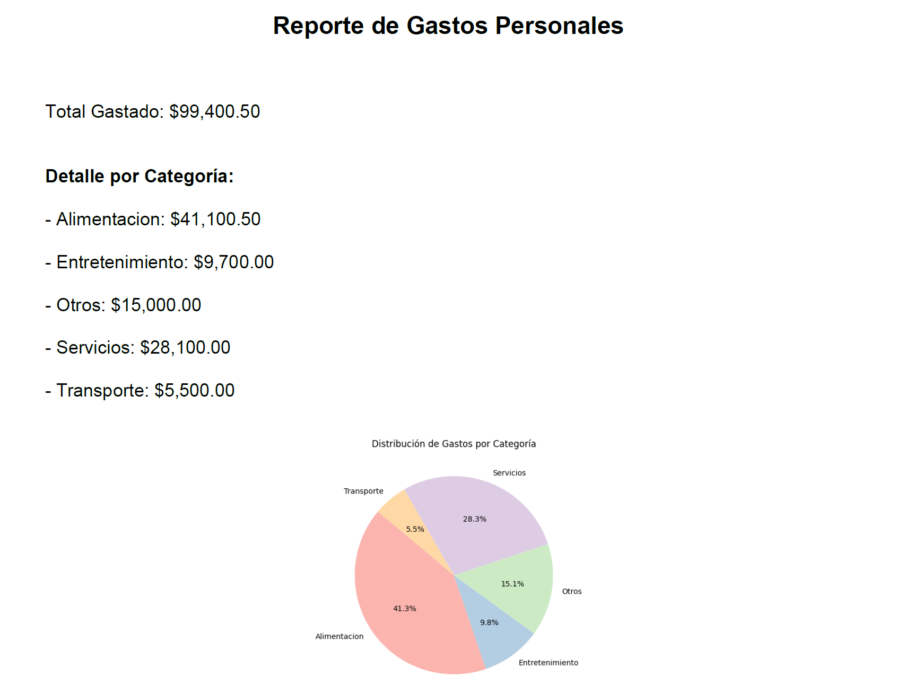

# Personal Finance Analyzer 📊💰

Una herramienta de análisis de datos desarrollada en Python que procesa archivos de gastos (CSV), realiza cálculos estadísticos y genera automáticamente un reporte financiero en formato PDF con gráficos visuales.

Este proyecto demuestra competencias en **Data Science**, **Manipulación de Datos** y **Automatización de Reportes**.

## ✨ Características

* **Procesamiento de Datos:** Ingesta y limpieza de datos crudos utilizando `Pandas`.
* **Análisis Estadístico:** Cálculo automático de totales, promedios y agrupación por categorías.
* **Visualización de Datos:** Generación de gráficos de torta (Pie Charts) con `Matplotlib`.
* **Reporte Automatizado:** Creación de un documento PDF final listo para imprimir usando `FPDF`.

## 📸 Funcionamiento

### 1. Procesamiento en Consola
El script lee el dataset, calcula las métricas y muestra un resumen rápido.


### 2. Reporte PDF Generado
El output final es un archivo PDF que incluye el resumen financiero y la visualización gráfica.


## 🛠️ Tecnologías Utilizadas

* **Lenguaje:** Python 3.10+
* **Análisis de Datos:** Pandas
* **Visualización:** Matplotlib
* **Reportes:** FPDF

## ⚙️ Instalación y Uso

Sigue estos pasos para ejecutar el analizador en tu entorno local:

### 1. Clonar el repositorio

```bash
git clone [https://github.com/ryakimovicz/finance-analyzer.git](https://github.com/ryakimovicz/finance-analyzer.git)
cd finance-analyzer
```

### 2. Crear entorno virtual e instalar dependencias

```bash
python -m venv venv
# Activar entorno (Windows: .\venv\Scripts\activate | Mac/Linux: source venv/bin/activate)
pip install -r requirements.txt
```

### 3. Ejecutar el análisis

Asegúrate de tener el archivo `gastos.csv` en la carpeta raíz (se incluye uno de prueba en el repositorio).

```bash
python analyzer.py
```

El script generará automáticamente el archivo `reporte_gastos.pdf` y `grafico_gastos.png`.

---
**Autor:** Román Yakimovicz  
Desarrollado como parte de mi portfolio de programación.

💼 **LinkedIn:** [linkedin.com/in/ryakimovicz](https://www.linkedin.com/in/ryakimovicz/)  
🐙 **GitHub:** [@ryakimovicz](https://github.com/ryakimovicz)  
📧 **Email:** [ryakimovicz@gmail.com](mailto:ryakimovicz@gmail.com)